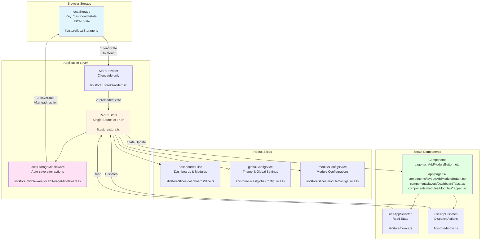

# Data Flow Diagram

This diagram visualizes how data is read and written in the Dashboard application.

## Interactive Mermaid Diagram



## Architecture Overview

```
┌─────────────────────────────────────────────────────────────────┐
│              BROWSER LOCALSTORAGE                                │
│              Key: "dashboard-state"                              │
│              File: lib/store/localStorage.ts                     │
│  ┌──────────────────────────────────────────────────────────┐  │
│  │ {                                                         │  │
│  │   dashboards: { ... },                                   │  │
│  │   globalConfig: { theme: "light" },                       │  │
│  │   moduleConfigs: { configs: { ... } }                    │  │
│  │ }                                                         │  │
│  └──────────────────────────────────────────────────────────┘  │
└─────────────────────────────────────────────────────────────────┘
                              ▲ │
                              │ │
                    ┌─────────┘ └─────────┐
                    │                     │
              [READ] │               [WRITE] │
                    │                     │
                    ▼                     │
┌─────────────────────────────────────────────────────────────────┐
│          StoreProvider (Client)                                 │
│          File: lib/store/StoreProvider.tsx                      │
│  ┌──────────────────────────────────────────────────────────┐  │
│  │ 1. Load state from localStorage on mount                  │  │
│  │ 2. Initialize Redux store with preloadedState            │  │
│  │ 3. Provide store to React components                     │  │
│  └──────────────────────────────────────────────────────────┘  │
└─────────────────────────────────────────────────────────────────┘
                              │
                              │
                              ▼
┌─────────────────────────────────────────────────────────────────┐
│                  REDUX STORE                                     │
│                  File: lib/store/store.ts                       │
│  ┌──────────────────────────────────────────────────────────┐  │
│  │  State:                                                   │  │
│  │  ┌────────────────────────────────────────────────────┐  │  │
│  │  │ dashboards:                                        │  │  │
│  │  │   File: lib/store/slices/dashboardsSlice.ts        │  │  │
│  │  │   - activeDashboardId: string                      │  │  │
│  │  │   - dashboards: Record<string, Dashboard>          │  │  │
│  │  └────────────────────────────────────────────────────┘  │  │
│  │  ┌────────────────────────────────────────────────────┐  │  │
│  │  │ globalConfig:                                       │  │  │
│  │  │   File: lib/store/slices/globalConfigSlice.ts      │  │  │
│  │  │   - theme: "light" | "dark"                        │  │  │
│  │  └────────────────────────────────────────────────────┘  │  │
│  │  ┌────────────────────────────────────────────────────┐  │  │
│  │  │ moduleConfigs:                                      │  │  │
│  │  │   File: lib/store/slices/moduleConfigsSlice.ts     │  │  │
│  │  │   - configs: Record<string, Record<string, any>>   │  │  │
│  │  └────────────────────────────────────────────────────┘  │  │
│  └──────────────────────────────────────────────────────────┘  │
│                                                                  │
│  ┌──────────────────────────────────────────────────────────┐  │
│  │  Middleware Chain:                                        │  │
│  │  [defaultMiddleware] → [localStorageMiddleware]        │  │
│  │  File: lib/store/middleware/localStorageMiddleware.ts    │  │
│  └──────────────────────────────────────────────────────────┘  │
└─────────────────────────────────────────────────────────────────┘
         ▲ │                                        │
         │ │                                        │
    [READ] │                                  [WRITE] │
         │ │                                        │
         │ └────────────────────────────────────────┘
         │
         │
┌─────────────────────────────────────────────────────────────────┐
│                REACT COMPONENTS                                  │
│  ┌──────────────────────────────────────────────────────────┐  │
│  │  Reading Data:                                            │  │
│  │  const data = useAppSelector((state) => state.dashboards)│  │
│  │  File: lib/store/hooks.ts                                │  │
│  └──────────────────────────────────────────────────────────┘  │
│  ┌──────────────────────────────────────────────────────────┐  │
│  │  Writing Data:                                            │  │
│  │  dispatch(addModule({ dashboardId, module }))            │  │
│  │  dispatch(setTheme("dark"))                              │  │
│  │  dispatch(updateModuleConfig({ moduleId, config }))      │  │
│  │  File: lib/store/hooks.ts                                │  │
│  └──────────────────────────────────────────────────────────┘  │
│                                                                  │
│  Components:                                                     │
│  • app/page.tsx (Home)                                          │
│  • components/layout/AddModuleButton.tsx                        │
│  • components/layout/DashboardTabs.tsx                         │
│  • components/modules/ModuleWrapper.tsx                          │
└─────────────────────────────────────────────────────────────────┘
```

## Sequence Diagrams

### 📖 READ Flow (Initialization)

```mermaid
sequenceDiagram
    participant Browser
    participant SP["StoreProvider<br/>lib/store/StoreProvider.tsx"]
    participant LS["localStorage<br/>lib/store/localStorage.ts"]
    participant RS["Redux Store<br/>lib/store/store.ts"]
    participant Comp["Component<br/>app/page.tsx, etc."]
    
    Browser->>SP: Component Mounts
    SP->>LS: loadState()
    LS-->>SP: JSON string or null
    SP->>SP: JSON.parse()
    SP->>RS: makeStore(preloadedState)
    RS-->>Comp: Store available via Provider
    Comp->>RS: useAppSelector()<br/>(lib/store/hooks.ts)
    RS-->>Comp: Current state
```

### ✍️ WRITE Flow (State Updates)

```mermaid
sequenceDiagram
    participant User
    participant Comp["Component<br/>components/layout/AddModuleButton.tsx"]
    participant RS["Redux Store<br/>lib/store/store.ts"]
    participant MW["localStorageMiddleware<br/>lib/store/middleware/localStorageMiddleware.ts"]
    participant LS["localStorage<br/>lib/store/localStorage.ts"]
    
    User->>Comp: User Action (e.g., Add Module)
    Comp->>RS: dispatch(addModule(...))<br/>(via useAppDispatch from lib/store/hooks.ts)
    RS->>RS: Reducer updates state<br/>(lib/store/slices/dashboardsSlice.ts)
    RS->>MW: Action processed
    MW->>RS: getState()
    RS-->>MW: Updated state
    MW->>LS: saveState(state)
    LS->>LS: JSON.stringify()
    LS->>LS: setItem('dashboard-state')
    RS-->>Comp: State update notification
    Comp->>Comp: Re-render with new state
```

## Detailed Data Flow

### 📖 READ Flow (Initialization)

```
1. Browser loads application
   ↓
2. StoreProvider component mounts (client-side only)
   File: lib/store/StoreProvider.tsx
   ↓
3. loadState() checks if window is available (SSR-safe)
   File: lib/store/localStorage.ts
   ↓
4. localStorage.getItem("dashboard-state")
   ↓
5. JSON.parse(serializedState) → Partial<RootState>
   ↓
6. makeStore(preloadedState) initializes Redux store
   File: lib/store/store.ts
   ↓
7. Components use useAppSelector() to read from store
   File: lib/store/hooks.ts
   Components: app/page.tsx, components/layout/AddModuleButton.tsx, etc.
```

### ✍️ WRITE Flow (State Updates)

```
1. User interacts with component (e.g., clicks "Add Module")
   Component: components/layout/AddModuleButton.tsx
   ↓
2. Component dispatches action via useAppDispatch()
   File: lib/store/hooks.ts
   ↓
3. Action dispatched: dispatch(addModule({ dashboardId, module }))
   Action from: lib/store/slices/dashboardsSlice.ts
   ↓
4. Redux store processes action through reducer
   File: lib/store/store.ts → lib/store/slices/dashboardsSlice.ts
   ↓
5. State updated in Redux store
   ↓
6. localStorageMiddleware intercepts after state update
   File: lib/store/middleware/localStorageMiddleware.ts
   ↓
7. saveState(store.getState()) serializes entire state
   File: lib/store/localStorage.ts
   ↓
8. JSON.stringify(state) → string
   ↓
9. localStorage.setItem("dashboard-state", serializedState)
   ↓
10. Components re-render with new state (React-Redux subscription)
```

## Store Structure

### Redux Slices

1. **dashboardsSlice**
   - File: `lib/store/slices/dashboardsSlice.ts`
   - Actions: `addDashboard`, `setActiveDashboard`, `addModule`, `removeModule`, `updateModulePosition`
   - State: Active dashboard ID and all dashboard definitions

2. **globalConfigSlice**
   - File: `lib/store/slices/globalConfigSlice.ts`
   - Actions: `setTheme`
   - State: Global application settings (theme, etc.)

3. **moduleConfigsSlice**
   - File: `lib/store/slices/moduleConfigsSlice.ts`
   - Actions: `setModuleConfig`, `updateModuleConfig`, `removeModuleConfig`
   - State: Per-module configuration data

### Middleware

**localStorageMiddleware**
- File: `lib/store/middleware/localStorageMiddleware.ts`
- Runs after every action
- Automatically saves complete state to localStorage
- No debouncing (note: comment suggests it could be added)

## Key Files

- `lib/store/store.ts` - Store configuration
- `lib/store/StoreProvider.tsx` - Initializes store with localStorage data
- `lib/store/localStorage.ts` - localStorage utilities (loadState, saveState, clearState)
- `lib/store/middleware/localStorageMiddleware.ts` - Auto-save middleware
- `lib/store/slices/*.ts` - Redux slices (state + actions)
- `lib/store/hooks.ts` - Typed Redux hooks (useAppSelector, useAppDispatch)

## Notes

- **SSR Safety**: All localStorage operations check `typeof window === "undefined"` to prevent SSR errors
- **Automatic Persistence**: Every state change is automatically saved to localStorage
- **Single Source of Truth**: Redux store is the single source of truth; localStorage is just persistence
- **Initial Load**: On first visit, defaults are used if no localStorage data exists

